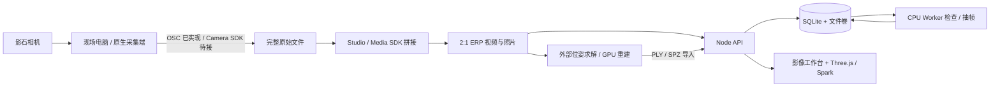

# 开图 · Unfold

**走一圈，让场地成为可调用的空间。**

2026 影石 Insta360 Bold Maker 智能影像挑战赛 · 赛道一原型。以 Club Med 南京仙林度假村为首个案例，连接现场影像采集、素材处理、空间浏览与服务接入。

核心是**影像工作台**。园区模型是可视化入口，取餐路线是放在最后的服务样例。“30 分钟上线”是需要现场计时验证的目标，尚非产品性能承诺。

## 快速运行

Node.js 22.13+（推荐 22 LTS；容器固定 22.22.1）。

```sh
npm ci
node scripts/init-env.mjs
npm run dev
```

另开两个终端，启动 API 和 CPU 任务处理器：

```sh
npm start
npm run worker
```

打开 Vite 输出的地址。在影像工作台的“导入 / 处理”中展开“连接素材与任务服务”，输入本机 `.env` 里的 `KAITU_API_TOKEN`，新建场地。密钥不要提交 Git 或分享到聊天。

CPU 处理需要 FFmpeg 和 ffprobe；可使用附带的 worker 容器。默认单文件云端上传上限 512 MB，浏览器预览上限 300 MB。原始 8K 长视频常超过此上限，建议本地拼接、裁剪，再上传轻量产物；当前未实现断点续传。

相机连接可选：现场电脑连接相机 Wi-Fi，在第三个终端运行 `npm run bridge`，回到本地网页的“采集”步骤检测设备。Vite 将 `/api/camera` 转到本地桥接，将其余 `/api` 转到素材服务。网页发布在公网后不能直接访问现场相机。

## 云服务器部署

```sh
node scripts/init-env.mjs
docker compose up -d --build
```

默认仅监听服务器 `127.0.0.1:8080`，适合 SSH 隧道验收。在 `.env` 设置已解析的 `KAITU_DOMAIN` 后启用 HTTPS：

```sh
docker compose --profile https up -d --build
```

完整的端口、数据卷、备份、更新与 GPU 扩展说明见 [云部署与体系架构](docs/云部署与体系架构.md)。当前为单服务器、单团队架构，不提供租户隔离、成员权限或公网注册。

## 功能与边界

| 能力 | 本版状态 |
|---|---|
| Three.js 参考场地：弧形建筑、材质、绿化、湖岸、路灯、赛事布展 | 可运行；尺寸、北向、布展位置待实拍校准 |
| 24 小时时间轴与自动演示 | 南京城市坐标、2026-09-23 的太阳轨迹近似计算；不作建筑日照评估 |
| 水幕光影秀 | 动态喷泉、扇形水雾、彩色投影与水面反光；19:30 是预演时间，非当天节目公告 |
| 六步影像工作台 | 现场指引、人工检查项、本机记录、计时、导入、导出清单 |
| 云端素材和任务 | 鉴权、SQLite WAL、文件持久化、任务队列、检查与 ERP 视频抽帧 |
| 2:1 全景与 Gaussian PLY / SPZ / SPLAT | Three.js + Spark 2.2 懒加载；本地或已上传素材预览 |
| 相机状态与开始/停止录像 | 真实 OSC 请求、串行执行、异步状态轮询；待比赛设备实机联调 |
| 取餐服务样例 | 点击菜品立即高亮餐台、更新路径；规则算法、示例菜单 |
| 原生 Camera SDK / Media SDK | 等待赛方正式二进制与授权；不能把 OSC 或 Studio 说成已完成原生 SDK 集成 |
| AI 语义、自动路网、GPU 3DGS 训练 | 尚未集成；CPU worker 不会假报重建成功 |

## 系统结构



## 文档

- [现场协作与拍摄清单](docs/现场协作与拍摄清单.md)：明天拍什么、如何交接。
- [SDK 与重建接入方案](docs/SDK与重建接入方案.md)：设备、拼接、位姿与训练各自职责。
- [场地研究与建模依据](docs/场地研究与建模依据.md)：公开来源、证据等级、待校准内容。
- [产品与演示方案](docs/产品与演示方案.md)：核心定位与三分钟演示。

## 验证

```sh
npm test
npm run build
```

测试覆盖路线、OSC 串行/错误/权限边界、云端鉴权与上传、持久化、任务互斥和失效恢复、真实 FFmpeg 抽帧、太阳方位基本关系。FFmpeg 不存在时抽帧测试会明确 skip。

当前本地 Node/API、FFmpeg 和网页构建已验证；本机未安装 Docker，因此尚未运行容器验收。`deploy/github-actions-ci.yml.example` 提供 CI 模板（测试、网页构建及两个 Docker target）。当前 GitHub 授权缺少 workflow 权限，因此未启用 Actions；以后可用具备权限的账户将模板放到 `.github/workflows/ci.yml`。相机、正式原生 SDK、现场真实重建仍待线下联调。

## 资料与数据

模型来自公开资料的人工解释，非精确测绘数字孪生。全景浏览不等于六自由度重建，3DGS 外观不等于可通行路网。PDF 组队提案、私有 SDK 包、原始影像、研究图片和访问密钥不包含在此仓库中。
