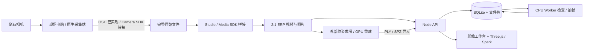

# 开图 · Unfold

**走一圈，让场地成为可调用的空间。**

2026 影石 Insta360 Bold Maker 智能影像挑战赛 · 赛道一原型。

**用途：用 X4 Air 全景内容连接游客逛吃与商户到店服务。** 影像工作台是空间接入核心；三维场景让用户理解场地，AI 行程与餐饮套餐提供消费入口，演示券和商家看板验证转化流程。

本版包含仙林度假村、栖霞山、老门东三个可切换场景，9 个即开即用行程、7 个虚构餐饮套餐和可操作的领券/核销沙盘。无须上传照片或填写商户信息即可演示。

点击顶部「老门东」→「一键演示」→「领演示券」→「去商家台核销」。v0.4 采用奶油色纸张、旅行明信片与可爱插画界面，加入两处南京地标的授权实拍对照图，以及可直接下载的 16 页路演产品说明书。

影像工作台点击「打开影石实拍样例」，可浏览由 **Insta360 ONE RS** 拍摄的孟买印度门 2:1 全景，拖动取景，导出带署名的横版 / 竖版静态图和来源清单；也可打开对应的人工照片参考模型。该样例并非南京或 X4 Air 实拍。当前场景的合成全景仍可一键生成，并明确标注为模拟素材。

栖霞山、老门东的历史全景页面已有检索记录，但原播放器目前返回「未查询到相关项目」，因此不内嵌不可播放的播放器；仙林度假村尚未找到可核验授权的影石全景。南京真实全景仍需现场拍摄或取得作者授权。所有内置照片的来源、署名与许可见 [素材授权清单](public/ASSET_LICENSES.md)。

“30 分钟上线”仍是需要现场计时验证的目标，尚非产品性能承诺。

## 快速运行

Node.js 22.13+（推荐 22 LTS；容器固定 22.22.1）。

```sh
npm ci
node scripts/init-env.mjs
npm run dev
```

另开两个终端，启动 API 和 CPU 任务处理器：

```sh
npm start
npm run worker
```

打开 Vite 输出的地址。在影像工作台的“导入 / 处理”中展开“连接素材与任务服务”，输入本机 `.env` 里的 `KAITU_API_TOKEN`，新建场地。密钥不要提交 Git 或分享到聊天。

CPU 处理需要 FFmpeg 和 ffprobe；可使用附带的 worker 容器。默认单文件云端上传上限 512 MB，浏览器预览上限 300 MB。原始 8K 长视频常超过此上限，建议本地拼接、裁剪，再上传轻量产物；当前未实现断点续传。

相机连接可选：现场电脑连接相机 Wi-Fi，在第三个终端运行 `npm run bridge`，回到本地网页的“采集”步骤检测设备。Vite 将 `/api/camera` 转到本地桥接，将其余 `/api` 转到素材服务。网页发布在公网后不能直接访问现场相机。

## 云服务器部署

```sh
node scripts/init-env.mjs
docker compose up -d --build
```

默认仅监听服务器 `127.0.0.1:8080`，适合 SSH 隧道验收。在 `.env` 设置已解析的 `KAITU_DOMAIN` 后启用 HTTPS：

```sh
docker compose --profile https up -d --build
```

完整的端口、数据卷、备份、更新与 GPU 扩展说明见 [云部署与体系架构](docs/云部署与体系架构.md)。当前为单服务器、单团队架构，不提供租户隔离、成员权限或公网注册。

## 功能与边界

| 能力 | 本版状态 |
|---|---|
| Three.js 参考场地：弧形建筑、材质、绿化、湖岸、路灯、赛事布展 | 可运行；尺寸、北向、布展位置待实拍校准 |
| 24 小时时间轴与自动演示 | 南京城市坐标、2026-09-23 的太阳轨迹近似计算；不作建筑日照评估 |
| 水幕光影秀 | 动态喷泉、扇形水雾、彩色投影与水面反光；19:30 是预演时间，非当天节目公告 |
| 六步影像工作台 | 现场指引、人工检查项、本机记录、计时、导入、导出清单 |
| 内置影石实拍与照片对照 | ONE RS 印度门全景、栖霞寺山门与老门东实拍；保留作者、许可证和来源链接 |
| 云端素材和任务 | 鉴权、SQLite WAL、文件持久化、任务队列、检查与 ERP 视频抽帧 |
| 2:1 全景与 Gaussian PLY / SPZ / SPLAT | Three.js + Spark 2.2 懒加载；本地或已上传素材预览 |
| 相机状态与开始/停止录像 | 真实 OSC 请求、串行执行、异步状态轮询；待比赛设备实机联调 |
| AI 逛吃与餐饮 | 9 套预置方案、本地朴素贝叶斯意图分类、约束校验、路线、行程卡导出、浏览器语音朗读 |
| 商业沙盘 | 7 套餐、演示券领取/核销、看板与导出；本机持久化，无真实交易 |
| 实时 AI 适配器 | 已实现服务端 Chat Completions 兼容接口，需配置模型地址/密钥；未用真实付费模型验收 |
| 原生 Camera SDK / Media SDK | 等待赛方正式二进制与授权；不能把 OSC 或 Studio 说成已完成原生 SDK 集成 |
| 自动视觉语义、自动路网、GPU 3DGS 训练 | 尚未集成；本地意图模型不理解上传影像，CPU worker 不会假报重建成功 |

## 系统结构



## 文档

- [16 页路演产品说明书（PDF）](public/docs/kaitu-product-manual.pdf)：作品、用户价值、影像技术、商业化与路演脚本。
- [用户调研与需求分析报告（PDF）](public/docs/kaitu-user-research-report.pdf)：证据分级、情景模拟访谈、竞品任务对照、影像工作台需求、验证方案与提交建议。模拟访谈已明确标注，不能替代赛事要求的 3 人次真实访谈。
- [调研报告可编辑正文](docs/research/report_content.py)：报告内容与来源边界；[PDF 生成脚本](docs/research/build_report.py)可复现最终文件。
- [说明书可编辑正文](docs/product/PRODUCT_MANUAL.md)：与 PDF 对应的文字版本。
- [现场协作与拍摄清单](docs/现场协作与拍摄清单.md)：明天拍什么、如何交接。
- [SDK 与重建接入方案](docs/SDK与重建接入方案.md)：设备、拼接、位姿与训练各自职责。
- [场地研究与建模依据](docs/场地研究与建模依据.md)：公开来源、证据等级、待校准内容。
- [产品与演示方案](docs/产品与演示方案.md)：商业定位、三场景与三分钟演示。
- [三场景技术与证据](docs/三场景技术与证据.md)：X4 Air 参数、参考来源、视觉技术与模型精度边界。

## 验证

```sh
npm test
npm run build
```

测试覆盖 9 条跨场地路线、套餐金额、本地意图与约束、券核销幂等性、AI 响应验证、OSC 串行/错误/权限边界、云端鉴权与上传、持久化、任务互斥和失效恢复、真实 FFmpeg 抽帧、太阳方位基本关系。FFmpeg 不存在时抽帧测试会明确 skip。

网页构建、行程与商业流程、场景几何可在受限环境中验证；完整 API / OSC 集成测试还需要允许监听本地回环端口，FFmpeg 抽帧需要可用的 FFmpeg。本机未安装 Docker，尚未运行容器验收。`deploy/github-actions-ci.yml.example` 提供 CI 模板（测试、网页构建及两个 Docker target）。当前 GitHub 授权缺少 workflow 权限，因此未启用 Actions；以后可用具备权限的账户将模板放到 `.github/workflows/ci.yml`。相机、正式原生 SDK、现场真实重建仍待线下联调。

## 资料与数据

模型来自公开资料的人工解释，非精确测绘数字孪生。全景浏览不等于六自由度重建，3DGS 外观不等于可通行路网。仓库包含按许可引入的三张照片、AI 生成的旅行插画，以及原创路演说明书；插画不作为实拍证据。用户提供的 PDF 组队提案、私有 SDK 包、未授权影像和访问密钥不包含在此仓库中。

## 可选实时 AI

在私有 `.env` 中配置 `AI_BASE_URL`（兼容服务的 `/v1` 基址）、`AI_MODEL`、`AI_API_KEY` 后重启 API。前端通过工作台输入部署访问密钥连接服务，再在「AI 逛吃 → AI 如何参与」点击实时 AI。服务端限制两路并发、25 秒超时，只接受当前场地目录中的方案 ID。浏览器不接收模型密钥。

静态 Sites 展示不运行 Node 后台，预置示例、本地意图分类、内置实拍 / 合成全景、券和看板均可直接使用。真实素材服务和实时模型需要独立云服务器部署。演示券仅存在当前浏览器 localStorage，不能作为多终端生产账本。
