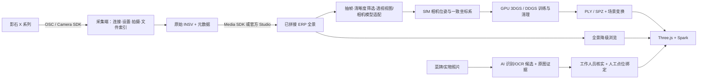

# SDK 如何融入方舟食境

设计原则：用户只看到“拍摄一个区域 → 处理完成 → 进入该空间找菜”；SDK 控制、拼接、位姿求解和高斯训练在采集端/处理端分工，统一由一个场景清单连接。

## 当前技术选择（2026-09-22 核对）

- Three.js 0.186.0：网格、参考建筑、空间交互。研究了官方 WebGPURenderer；它默认 WebGPU 且可降级 WebGL2，但本原型选 WebGLRenderer 以复用 Spark 已支持的混合渲染，不宣称 WebGPU。
- Spark 2.2.0：GitHub 官方项目，支持 Three.js + Gaussian 混合场景；当前独立资产查看器接受 PLY/SPZ/SPLAT，动态导入降低首屏开销。
- 官方 OSC：当前已实现状态、开始/停止录像；通过 Node 本地桥接避免浏览器跨域/局域网访问问题，命令串行发送，异步任务轮询状态。
- 原生 SDK：接口边界已规划，二进制/实际 sample 尚未取得；不会虚构 SDK 类名、可执行文件或“已连接”状态。

## 数据路径



### Camera SDK：采集能力

根据本地赛事指南，X 系列 Camera/Media SDK 有 Android/iOS 与 Windows/Linux 支持；当前 macOS 不在该桌面 X 系列二进制支持表中。macOS 电脑可先使用 OSC，或由 Android 设备承担原生采集。不能把 Link 的 macOS 协议支持迁移理解成 X5 的 SDK 支持。

后续让 Android/Windows/Linux sample 提供统一内部接口：

```text
getStatus() -> connected, model, battery, storage, firmware
getCapabilities() -> supported modes and parameters
startCapture(sessionId, validatedCaptureProfile) -> command state
stopCapture(sessionId) -> actual file group
listFiles(sessionId) -> original filename, bytes, time, lens/segment grouping
```

这些是项目内部接口设计，不是影石 SDK 原生方法名。取得安装包后，依 sample 实际签名实现适配层。浏览器继续调用 `/api/camera/*`，无需改用户流程。

### 当前 OSC 桥接

实现于 `bridge/osc.mjs` 和 `bridge/server.mjs`，只访问官方常见 AP 地址 `192.168.42.1`。客户端须先连接相机 Wi-Fi；Wi-Fi 可能不能同时联网，依本地已缓存依赖运行。

| 项目 API | 相机请求 | 状态 |
|---|---|---|
| GET `/api/camera/status` | GET `/osc/info` + POST `/osc/state` | 真实请求，尚待设备联调 |
| POST `/api/camera/start` | 检查存储卡和 `captureMode`，再 `camera.startCapture` | 不擅自覆盖曝光与拍摄设置 |
| POST `/api/camera/stop` | `camera.stopCapture`，必要时轮询 | 返回真实结果，文件留在相机 |

请求包含官方要求的 `X-XSRF-Protected`。相机错误显式返回，不以 HTTP 200 误判成功；超时后不自动重复开始/停止命令。当前未实现原文件自动下载，现场采用数据线拷贝；后续需要保留录像配对文件和分段关系。

OSC 文档老仓库已声明迁移到新开发者站，且旧版“startCapture”段落的 JSON 示例误写为 stopCapture；实现依据命令说明及同页后续 startCapture 示例，必须以实际机型与最新文档再验收。

### Media SDK：双鱼眼变 ERP

赛事指南明确，X 系列正常预览是 H.264/H.265 双鱼眼流，需解码、拼接；高分辨率可能分为 `stream_index 0/1`，需同步两路与 IMU。正常预览不等于带音频的直播；推荐先以指南中的 1920×960 做预览联调。

比赛 MVP 优先做离线文件链路，避免同时把多流低延迟、同步、重建和导航都作为关键路径。视频原始文件经 Media SDK 拼接为 2:1 ERP MP4/JPG；桌面 Media SDK GPU 要求按赛方包执行。Studio 可作为人工导出替代，但不能声称是自研 SDK 自动链路。

如果确实需要标定内参/外参，应按赛事指南通过工作人员申请 Metadata SDK Offset 版本和相关协议；不猜内参，也不假设 ERP 图像已经带有 SfM 位姿。

### 重建不是一条“自动串起来”的算法清单

- DAP 官方实现输入 ERP 并预测深度；适合检查几何、深度辅助和研究增强。单图深度不自动保证真实尺度、正确遮挡或完整背面。
- DDGS 官方实现需要数据准备、相机位姿/点云及训练，README 环境假设 CUDA 12.1。它不是 JavaScript 浏览器 SDK，也不是直接把 INSV 丢进去即可运行的转换器。
- ERP 若转透视切片，必须保留帧时间、切片方向与 FOV，并正确处理同一相机中心的多个视图。不能把所有切片当成独立已知平移的相机。首先跑通一个小场景 SfM，再训练。
- DAP 输出与 DDGS 训练输入之间仍需尺度、投影、置信度和坐标适配，未经实验不能称为即插即用。
- DiT360 可用于明确标注的想象场景，不用于填充真实场地后再声称实景复原。
- AirSim360 适用于无人机仿真/数据生成，不是本次餐饮 MVP 的必要依赖。

可选主办方现成 3DGS 服务，优先导出约几十 MB 的餐台/餐厅子场景；前端没有硬编码单一训练器。训练用时与显存需求必须依据真实样例测量，不承诺即时全园区重建。

## 坐标与版本

首个真实模型进入前先确定至少三个不共线公共锚点及两条实测长度，求 `scale + rotation + translation`。保存：

```json
{
  "sceneId": "XL-01",
  "evidence": "captured",
  "capturedAt": "待填实际采集时间",
  "asset": "restaurant.spz",
  "transform": {"scale": 1, "rotation": [0,0,0], "translation": [0,0,0]},
  "registrationStatus": "pending",
  "coordinateSystem": "local-unscaled",
  "anchors": [],
  "sourceFiles": [],
  "menuVersion": null
}
```

这里的单位变换仅是结构样例，不是已完成配准。全局模型和餐厅模型可分别渲染，通过场景清单衔接。菜品记录绑定 `sceneId + anchorId + menuVersion`，重建更新时可以重新配准而不重写全部菜品内容。

## AI 的真实价值与接入验收

计划的 AI 职责：菜牌 OCR / 菜品候选识别 → 返回原图引用与置信度 → 人工确认 → 绑定餐台点位 → 按用户口味组织路线。

不让大模型凭空生成可用路线；AI 输出只能引用已存在的菜品 ID，通道图算法负责可达性。不能从照片推断精确克重、热量、隐藏成分或食品安全。当前页面明确标注偏好匹配为规则演示，AI 服务尚未接入。

下一轮以三张现场照片验证：真实服务返回结构化 `dishCandidates / visibleText / evidenceImage / confidence / needsReview`，人工确认后再发布到菜单。将推理凭据置于后端，不放前端源码。

## 实机验收清单

1. 真相机状态含真实型号与电量，断开时明确失败。
2. 开始与停止命令确实对应设备录像，并保存完整原始文件组。
3. 30–60 秒素材成功拼接，水平线、拼接缝、曝光没有严重异常。
4. 小场景重建输出在网页导入，方向可校正且无明显关键区域缺失。
5. 3 个现场菜品及餐台可定位；原图、识别结果、人工确认可追溯。
6. 现场参与者完成任务，记录有效结果。

截至本版，单元测试与浏览器原型已验证；没有相机、SDK 二进制、现场素材或 CUDA 训练任务的实测证据。

## 一手技术来源

- https://insta360develop.github.io/Insta360-Developer_Docs/ch/
- https://github.com/Insta360Develop/Insta360_OSC
- https://github.com/sparkjsdev/spark
- https://threejs.org/manual/pages/webgpurenderer
- https://github.com/Insta360-Research-Team/DAP
- https://github.com/Insta360-Research-Team/DDGS
- https://www.insta360.com/cn/support
